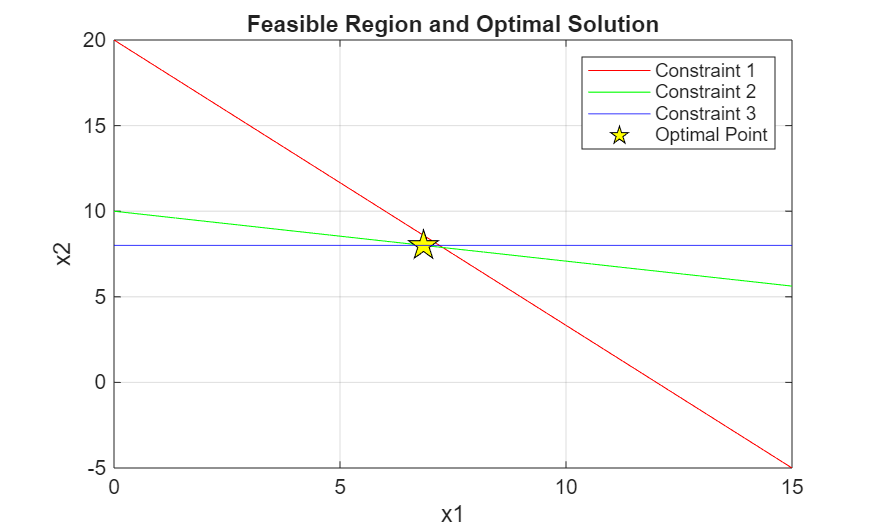

# Linear Programming: Exhaustive Search 

## Mathematical Model
The algorithm solves problems in the following standard form:
- **max**: $z = c^T x$
- **subject to**: $Ax = b, \quad x \geq 0$

## Example Parameters

Using the parameters provided in the assignment:

**Vector $c$ and $b$:**

$$
c = \begin{bmatrix} 10 \\ 40 \\ 0 \\ 0 \\ 0 \end{bmatrix}, \quad b = \begin{bmatrix} 480 \\ 480 \\ 480 \end{bmatrix}
$$

**Constraint Matrix $A$:**

$$
A = \begin{bmatrix} 
40 & 24 & 1 & 0 & 0 \\ 
14 & 48 & 0 & 1 & 0 \\ 
0 & 60 & 0 & 0 & 1 
\end{bmatrix}
$$

## Results
- **Optimal Objective Value**: 388.5714
- **Optimal x**: `[6.8571, 8.0000, 13.7143, 0, 0]`

## Visualization

